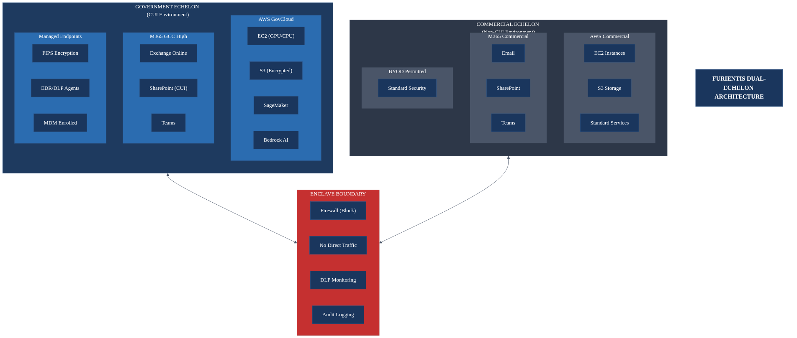
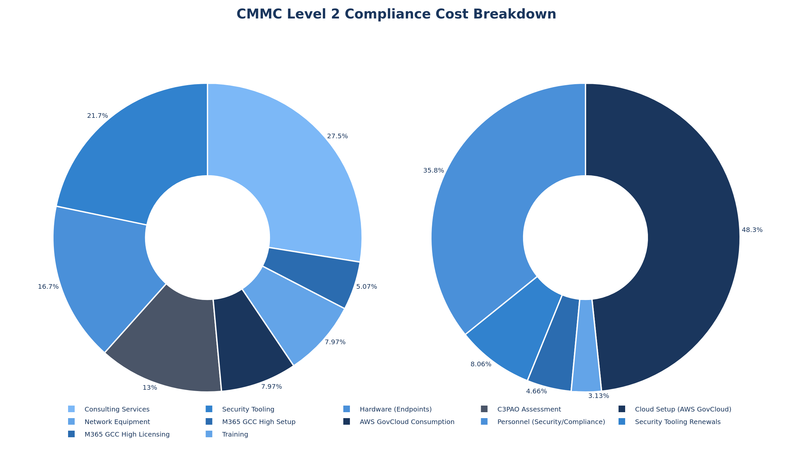
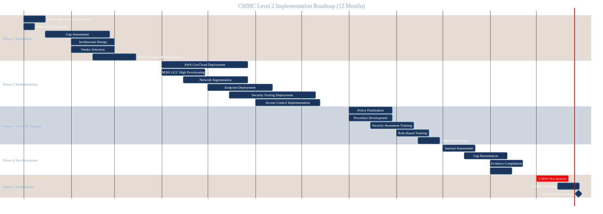

# Furientis CMMC Level 2 Compliance Strategy

## A Comprehensive Guide to CMMC Certification, Dual-Echelon Architecture, and Operational Excellence

**Version:** 1.0
**Date:** December 2025
**Prepared for:** Furientis Leadership
**Classification:** Internal Use Only

---

## 1. Executive Summary

Furientis stands at a critical inflection point. As a defense technology startup seeking to compete for Department of Defense contracts, the company must achieve Cybersecurity Maturity Model Certification (CMMC) Level 2 compliance before it can access the lucrative and strategically important government contracting market. This requirement, which became enforceable on November 10, 2025, represents both a significant challenge and a competitive opportunity. Organizations that achieve certification early will find themselves with access to contracts that their non-compliant competitors cannot pursue.

This document provides Furientis leadership with a comprehensive roadmap for achieving CMMC Level 2 certification within a 6-12 month timeframe. The analysis presented here is based on the current regulatory framework, industry best practices, and the specific operational requirements of a startup engaged in software development, artificial intelligence and machine learning research, and data analytics. The recommendations account for Furientis's greenfield starting position, which, while requiring significant upfront investment, actually provides advantages over organizations that must retrofit legacy systems and processes.

The central strategic recommendation of this document is the implementation of a dual-echelon architecture. This approach creates a clearly bounded CUI enclave for government work while maintaining a separate, unencumbered commercial environment. By limiting CMMC scope to only the systems that actually handle CUI, Furientis avoids subjecting its entire operation to compliance controls, preserving startup agility for commercial work while meeting all government requirements. Section 3 details this architecture, including network diagrams and implementation guidance.

The financial investment required for CMMC Level 2 compliance is substantial but manageable for a startup of Furientis's size. Initial implementation costs are estimated between $280,000 and $480,000, with ongoing annual operational costs ranging from $390,000 to $730,000 depending on team size and cloud consumption. These figures include cloud infrastructure (AWS GovCloud and Microsoft 365 GCC High), security tooling, endpoint hardware, professional services for gap assessment and remediation, dedicated security/compliance personnel, and the third-party assessment itself. While significant, these costs must be weighed against the revenue potential of DoD contracts, which often run into millions of dollars and typically span multiple years.

The risks of non-compliance are equally significant. Organizations that fail to achieve CMMC certification by the time contract requirements specify it will find themselves locked out of the defense industrial base. There is no grace period, no waiver process for the core requirements, and no alternative path to certification. The DoD has made clear that CMMC compliance is a prerequisite for contract award, not a condition that can be satisfied after the fact. Furientis must therefore treat this initiative with the urgency and resource commitment it deserves.

---

## 2. Understanding CMMC Level 2: Requirements, Assessment, and Certification

### 2.1 The Evolution and Purpose of CMMC

The Cybersecurity Maturity Model Certification program represents the culmination of decades of effort by the Department of Defense to secure its supply chain against increasingly sophisticated cyber threats. The defense industrial base has been under sustained attack from nation-state adversaries, criminal organizations, and other threat actors seeking to steal sensitive technical data, intellectual property, and controlled information. High-profile breaches at major defense contractors have resulted in the loss of weapons system designs, research data, and other information critical to national security.

Prior to CMMC, the DoD relied on contractor self-attestation to cybersecurity requirements specified in DFARS clause 252.204-7012 and NIST Special Publication 800-171. This approach proved inadequate. Audits and assessments consistently revealed that contractors were claiming compliance while failing to implement even basic security controls. The disconnect between self-reported compliance and actual security posture created unacceptable risk to the defense mission.

CMMC addresses this gap by requiring third-party assessment of cybersecurity practices before contract award. Rather than trusting contractors to accurately assess their own security, the DoD now requires independent verification by accredited assessors. This shift fundamentally changes the compliance landscape. Organizations cannot simply claim compliance; they must demonstrate it to trained assessors who will examine documentation, interview personnel, and test technical controls.

The CMMC 2.0 framework, which replaced the original five-level model with a streamlined three-level structure, became effective in November 2025. Level 1 addresses basic safeguarding of Federal Contract Information (FCI) and requires only annual self-assessment against 17 practices. Level 2, which is Furientis's target, requires third-party assessment against the full 110 practices of NIST SP 800-171 Rev. 2 and applies to contractors handling Controlled Unclassified Information. Level 3, reserved for the most sensitive programs, adds enhanced security requirements beyond NIST 800-171 and requires government-led assessment.

| Level | Description | Assessment Type | Practices | Data Type | Certification Validity |
|-------|-------------|-----------------|-----------|-----------|------------------------|
| Level 1 | Foundational | Annual Self-Assessment | 17 | FCI | 1 year |
| Level 2 | Advanced | Third-Party (C3PAO) | 110 | CUI | 3 years |
| Level 3 | Expert | Government-led (DCMA) | 110+ | Critical CUI | 3 years |

### 2.2 The 110 Security Practices Across 14 Domains

CMMC Level 2 compliance requires implementation of 110 security practices organized into 14 domains. Each domain addresses a specific aspect of cybersecurity, and together they form a comprehensive security program covering everything from access control to incident response to physical security. Understanding these domains is essential for planning implementation, as they define the scope of technical controls, policies, procedures, and evidence that must be in place.

Access Control, with 22 practices, is the largest domain and addresses how organizations manage who can access what resources under what circumstances. The practices in this domain cover account management, least privilege implementation, separation of duties, remote access controls, wireless access restrictions, and session management. For a technology company like Furientis, implementing these controls means deploying identity management systems, enforcing multi-factor authentication, configuring role-based access to development environments and data stores, and establishing secure remote work policies.

Awareness and Training requires organizations to ensure that all personnel understand their security responsibilities. The three practices in this domain mandate security awareness training for all users, specialized training for personnel with security roles, and training on recognizing and reporting potential threats. Furientis must establish a training program that covers CUI handling, phishing recognition, incident reporting procedures, and role-specific security topics.

Audit and Accountability encompasses nine practices focused on logging, log review, and log protection. Organizations must capture audit logs of security-relevant events, review those logs regularly for indicators of malicious activity, protect logs from tampering, and retain them for appropriate periods. For Furientis, this means deploying centralized logging infrastructure, establishing log review procedures, and implementing tamper-evident log storage.

Configuration Management addresses how organizations establish and maintain secure configurations for systems and applications. The nine practices cover baseline configuration development, change management, least functionality principles, and restrictions on user-installed software. Furientis must document approved configurations for all system components, establish change control procedures, and implement technical controls that enforce configuration standards.

Identification and Authentication focuses on verifying the identity of users, devices, and processes. The 11 practices require unique identification for all users, multi-factor authentication for network and privileged access, replay-resistant authentication mechanisms, and controls for authenticator management. Implementing these controls requires deploying enterprise identity management, configuring MFA across all systems, and establishing password and credential policies.

Incident Response, with three practices, requires organizations to establish incident handling capabilities, implement incident monitoring and reporting, and test incident response plans. While the practice count is low, the underlying requirements are substantial. Furientis must develop incident response procedures, train personnel on their roles during incidents, establish relationships with law enforcement and the DoD for reporting, and conduct regular tabletop exercises.

Maintenance covers six practices related to system maintenance activities. Controls address authorized maintenance, maintenance personnel oversight, remote maintenance security, and maintenance tool management. For cloud-native environments like those Furientis will operate, many traditional maintenance concepts translate to patch management, update procedures, and change control.

Media Protection encompasses nine practices governing how organizations handle, mark, sanitize, and destroy media containing CUI. This domain requires marking media with appropriate CUI designations, controlling access to media, sanitizing media before disposal or reuse, and protecting media during transport. Furientis must establish procedures for handling laptops, removable drives, backup tapes, and any other media that may contain CUI.

Personnel Security, with only two practices, addresses screening of personnel before granting access and managing access when personnel depart. Furientis must conduct appropriate background investigations, ensure personnel understand their security obligations, and promptly revoke access when employment terminates.

Physical Protection contains six practices addressing facility security, visitor management, and physical access to systems. Even in an increasingly cloud-based world, organizations must still control physical access to workstations, offices, and any on-premises equipment. Furientis must establish visitor procedures, implement access controls for spaces where CUI is accessed, and maintain visitor logs.

Risk Assessment requires organizations to periodically assess risks to organizational operations and assets, scan for vulnerabilities, and remediate findings. The three practices in this domain establish the foundation for risk-based security decision-making. Furientis must conduct regular risk assessments, implement vulnerability scanning, and establish processes for prioritizing and addressing findings.

Security Assessment, with four practices, addresses how organizations evaluate the effectiveness of their security controls, develop plans to remediate deficiencies, and authorize systems for operation. This domain requires internal assessments, POA&M development and management, and ongoing monitoring.

System and Communications Protection is the second largest domain with 16 practices covering boundary protection, encryption, network segmentation, and transmission security. Controls address separation of user and system functionality, denial of service protection, cryptographic protections for data at rest and in transit, and architectural security features. This domain drives many of the technical architecture decisions for the CUI enclave.

System and Information Integrity contains seven practices addressing malware protection, security alert monitoring, flaw remediation, and system monitoring. Organizations must implement anti-malware solutions, monitor security advisories, patch vulnerabilities promptly, and maintain awareness of system security status.

| Domain | Abbrev | Practices | Key Focus Areas |
|--------|--------|-----------|-----------------|
| Access Control | AC | 22 | Least privilege, session management, remote access |
| Awareness & Training | AT | 3 | Security awareness, role-based training |
| Audit & Accountability | AU | 9 | Logging, audit review, audit protection |
| Configuration Management | CM | 9 | Baseline configs, change control |
| Identification & Authentication | IA | 11 | MFA, password policies, device auth |
| Incident Response | IR | 3 | IR capability, reporting, testing |
| Maintenance | MA | 6 | Controlled maintenance, remote maintenance |
| Media Protection | MP | 9 | Media handling, sanitization, transport |
| Personnel Security | PS | 2 | Screening, personnel actions |
| Physical Protection | PE | 6 | Physical access, visitor control |
| Risk Assessment | RA | 3 | Risk assessments, vulnerability scanning |
| Security Assessment | CA | 4 | Security assessments, POA&M |
| System & Comm Protection | SC | 16 | Boundary protection, encryption, CUI handling |
| System & Info Integrity | SI | 7 | Flaw remediation, malware protection, monitoring |

### 2.3 The Assessment Process and Certification Path

Achieving CMMC Level 2 certification requires successful completion of an assessment conducted by an accredited CMMC Third-Party Assessment Organization, commonly referred to as a C3PAO. These organizations employ certified assessors who have been trained and authorized by the Cyber AB (formerly the CMMC Accreditation Body) to evaluate contractor compliance. The assessment process is rigorous, structured, and designed to verify that organizations have actually implemented the required controls rather than simply documenting that they intend to do so.

The assessment process begins well before the C3PAO arrives on site. Organizations must first complete their internal readiness activities, including a comprehensive self-assessment against all 110 practices. This self-assessment should identify any gaps between current state and required state, and organizations should remediate those gaps before scheduling the formal assessment. Attempting to pass a C3PAO assessment without thorough preparation is both expensive and likely to fail, as assessment fees are non-refundable and failed assessments become part of the organization's record.

When the formal assessment begins, the C3PAO team will review documentation, conduct interviews, and examine technical evidence. The assessment uses 320 assessment objectives derived from NIST Special Publication 800-171A, with multiple objectives mapping to each of the 110 practices. For each objective, the assessor must determine whether the organization has implemented the requirement. Findings fall into three categories: MET, NOT MET, or NOT APPLICABLE.

An organization must achieve a MET determination on all assessment objectives to receive full certification. However, recognizing that achieving perfect compliance from the outset is challenging, CMMC 2.0 introduced a conditional certification pathway. Organizations that achieve at least 80% compliance and satisfy all objectives identified as "essential" can receive conditional certification, provided they submit a Plan of Action and Milestones (POA&M) addressing the remaining gaps. Conditional certification is valid for 180 days, during which the organization must remediate all open items and complete a closeout assessment.

Full certification, once achieved, is valid for three years. During this period, organizations must maintain their security posture and affirm continued compliance annually. Significant changes to the environment, such as major system modifications or changes in CUI handling, may trigger requirements for re-assessment.

### 2.4 Essential Documentation for Certification

Successful CMMC certification requires extensive documentation demonstrating that security controls are not only implemented but are implemented correctly, consistently, and in a manner that can be sustained over time. The documentation package serves multiple purposes: it provides evidence to assessors, guides organizational personnel in maintaining security practices, and creates an audit trail for compliance monitoring.

The System Security Plan stands as the cornerstone of CMMC documentation. This comprehensive document describes the organization's information systems, the security controls implemented to protect those systems, and the operational environment in which the systems function. A well-constructed SSP maps each of the 110 practices to specific implementations, identifying the technologies, processes, and personnel responsible for each control. The SSP should be sufficiently detailed that a knowledgeable reader could understand how the organization addresses each requirement, while remaining concise enough to be maintainable as the environment evolves.

The Plan of Action and Milestones documents any gaps in the current security posture and the organization's plan for addressing them. Even organizations with mature security programs typically have some items on their POA&M, whether emerging vulnerabilities requiring remediation, planned improvements, or controls that are partially implemented. The POA&M must identify specific milestones, responsible parties, and target completion dates. Assessors will review the POA&M to evaluate the organization's security management processes and verify that identified weaknesses are being addressed systematically.

Network diagrams provide assessors with a visual representation of the organization's technical architecture. These diagrams should clearly show network boundaries, security zones, connection points, and the location of security controls such as firewalls and intrusion detection systems. For a dual-echelon architecture like that recommended for Furientis, the diagrams must clearly depict the separation between the CUI enclave and commercial environment.

Data flow diagrams trace the movement of CUI through organizational systems, from initial receipt through processing, storage, and eventual disposal or return. These diagrams help assessors understand the scope of CUI handling and verify that appropriate controls exist at each point where CUI is accessed or processed.

Policies and procedures document the organizational rules and operational steps for each control domain. While templates are available, organizations should customize their policies to reflect actual practice rather than adopting boilerplate language that may not align with how the organization actually operates. Assessors will interview personnel and examine technical evidence to verify that documented procedures are actually followed.

Evidence of implementation provides proof that controls are functioning as intended. This evidence takes many forms: configuration screenshots, audit log samples, training records, access control lists, vulnerability scan results, and incident response exercise reports, among others. Organizations should establish an evidence collection process well before assessment, as gathering this material during the assessment itself is time-consuming and stressful.

---

## 3. The Dual-Echelon Architecture: Separating Government and Commercial Operations

### 3.1 Strategic Rationale for Separation

The decision to implement a dual-echelon architecture at Furientis reflects both regulatory reality and operational pragmatism. Not all of Furientis's work involves CUI or government contracts, yet the CMMC framework makes no distinction between systems that handle CUI and systems that merely coexist on the same network or within the same organizational boundary. Without deliberate separation, the entire Furientis environment would fall within the assessment scope, subjecting commercial projects to the same stringent controls required for government work.

This total-organization approach would impose significant costs and operational friction on work that does not require such protections. Commercial clients do not expect or require that their data be handled under CMMC controls, and applying those controls would slow development cycles, increase infrastructure costs, and limit the flexibility that gives startups their competitive advantage. The dual-echelon approach allows Furientis to maintain two distinct operational environments: a tightly controlled government echelon where CUI processing occurs under full CMMC compliance, and a more flexible commercial echelon where normal business operations proceed without compliance overhead.

The concept of the CUI enclave derives from NIST and DoD guidance on security domain boundaries. An enclave is defined as a set of system resources that operate within the same security domain and share the protection of a single, common, and continuous security perimeter. By establishing a clearly bounded enclave for CUI processing, Furientis can limit its CMMC compliance scope to only those systems, networks, and personnel that actually touch government data. Everything outside the enclave boundary falls outside the assessment scope, provided the boundary is properly implemented and maintained.

The benefits of this approach are substantial. Compliance costs decrease because fewer systems require hardening, monitoring, and assessment. Operational flexibility increases because commercial work proceeds without the documentation, approval, and control requirements that CMMC imposes. Evidence collection becomes simpler because the environment being assessed is smaller and more homogeneous. Risk is isolated because a security incident in the commercial environment does not automatically compromise the CUI enclave, and vice versa.

However, separation also introduces complexity. The organization must maintain two distinct sets of infrastructure, two identity management systems, two sets of workstations, and clear procedures for ensuring that CUI never crosses the boundary into the commercial environment. Personnel who work on both government and commercial projects must understand which environment they are operating in and apply appropriate handling procedures. The architecture must be designed to make boundary violations difficult and detectable, not merely procedurally prohibited.

| Benefit | Government Echelon | Commercial Echelon |
|---------|-------------------|-------------------|
| Compliance Scope | Full CMMC Level 2 (110 controls) | No CMMC requirements |
| Cloud Infrastructure | AWS GovCloud, M365 GCC High | AWS Commercial, M365 Commercial |
| Endpoint Requirements | Org-managed, FIPS encryption, EDR | BYOD permitted, standard security |
| Data Handling | CUI controls, DLP, audit logging | Standard business practices |
| Operational Flexibility | Controlled change management | Agile, rapid iteration |
| Cost per User | Higher (compliance overhead) | Lower (standard tooling) |

### 3.2 Architecture Design: Physical and Logical Separation

The Furientis dual-echelon architecture employs both physical and logical separation mechanisms to establish a robust boundary between the government and commercial environments. Physical separation provides the strongest assurance that data cannot cross boundaries, as systems that are not connected cannot exchange data regardless of software configuration. Logical separation, implemented through network segmentation, access controls, and identity management, provides flexibility and cost efficiency while still maintaining meaningful boundaries.

*Figure 1: Dual-Echelon Architecture showing the separation between Government (CUI) and Commercial (Non-CUI) environments with the enclave boundary controls.*

The government echelon is built on a foundation of FedRAMP-authorized cloud services. Amazon Web Services GovCloud provides the compute, storage, and AI/ML infrastructure required for CUI processing. AWS GovCloud operates in physically isolated data centers within the continental United States, staffed exclusively by U.S. citizens who have been screened and cleared. The infrastructure is designed to meet FedRAMP High and DoD Impact Level 4 and 5 requirements, providing a baseline of security controls that organizations can build upon. Microsoft 365 GCC High provides productivity and collaboration tools, including email, document storage, and communication platforms, in an environment specifically designed for CUI handling.

Within the government echelon, Furientis will deploy dedicated workstations for personnel handling CUI. These workstations will be organizationally owned and managed, configured to meet CMMC requirements for endpoint security, and equipped with full-disk encryption using FIPS 140-2 validated cryptographic modules. Each workstation will run endpoint detection and response software, data loss prevention tools, and will be enrolled in the organization's mobile device management system. Personnel will access these workstations only from controlled locations, with remote access permitted only through approved secure access methods.

The commercial echelon operates on standard commercial cloud services and infrastructure. AWS commercial regions provide compute and storage for non-CUI projects, while Microsoft 365 commercial provides productivity tools. The commercial echelon is not subject to CMMC requirements, and thus can operate with lighter-weight security controls appropriate to the data being processed. Bring-your-own-device policies may be permitted in the commercial echelon, and developers have greater flexibility in tooling and process choices.

The boundary between echelons is enforced through multiple mechanisms. Network segmentation ensures that traffic cannot flow directly between government and commercial systems. Firewalls at the boundary inspect and block any attempted connections, with logging to detect boundary violation attempts. Identity systems are separate; personnel have distinct credentials for each echelon, and authentication to one environment does not grant access to the other. Data loss prevention tools monitor for patterns that might indicate CUI and can block transfers that violate policy.

Personnel who work on both government and commercial projects must understand and follow procedures for transitioning between environments. These procedures include physical separation (different workstations, potentially different work locations), credential separation (distinct usernames and passwords), and cognitive separation (deliberate acknowledgment of which environment they are entering). Training emphasizes the importance of never transferring data between echelons without explicit authorization and proper sanitization procedures.

### 3.3 CUI Enclave Design Principles

The government echelon operates as a CUI enclave following design principles established by the DoD and NIST. These principles ensure that the enclave boundary is clearly defined, consistently enforced, and resistant to both accidental and intentional breach attempts. Adherence to these principles is essential for maintaining the enclave's integrity and for demonstrating to assessors that the boundary is meaningful rather than notional.

The first principle is strict boundary definition. Every system that processes, stores, or transmits CUI must reside within the enclave boundary. Systems that provide services to the enclave but do not themselves handle CUI (such as network infrastructure devices) may be considered boundary devices subject to specific controls. Systems outside the enclave must not have any pathway to access CUI, whether through network connectivity, shared storage, or removable media transfer. The boundary must be documented in network diagrams and data flow diagrams, and any changes to the boundary require formal review and approval.

The second principle is defense in depth. The enclave does not rely on any single control to protect CUI. Multiple layers of security ensure that failure of any one control does not result in unauthorized access or data loss. Access requires successful authentication and authorization at multiple points. Data is encrypted both in transit and at rest, so that interception or theft of storage media does not expose content. Monitoring systems watch for anomalies that might indicate compromise.

The third principle is least privilege. Personnel and systems within the enclave are granted only the minimum access required to perform their functions. Users do not have administrative access to their workstations unless required and approved. Service accounts run with restricted privileges. Data access is granted on a need-to-know basis, with projects segregated even within the enclave when different clearance levels or access requirements apply.

The fourth principle is continuous monitoring. The enclave is not secured once and then left unattended. Security monitoring systems continuously analyze logs, network traffic, and system behavior for indicators of compromise or policy violation. Vulnerability scans run regularly to identify missing patches or misconfigurations. Security personnel review alerts and investigate anomalies. This continuous vigilance ensures that the security posture is maintained over time and that emerging threats are detected and addressed promptly.

*Figure 2: CUI Data Flow showing how controlled information moves through the Government Echelon from external sources through processing to secure storage, with comprehensive audit logging and encryption.*

---

## 4. Cloud Infrastructure Strategy: AWS GovCloud and Microsoft 365 GCC High

### 4.1 AWS GovCloud for Compute, Storage, and AI/ML Workloads

Amazon Web Services GovCloud (US) provides the foundation for Furientis's CUI processing infrastructure. Unlike standard AWS commercial regions, GovCloud operates under special governance and technical controls designed to meet the stringent requirements of federal agencies and their contractors. Understanding these controls, and how they differ from commercial AWS, is essential for planning the Furientis deployment.

GovCloud regions are physically isolated from commercial AWS infrastructure. The data centers are located within the continental United States, and physical access is restricted to U.S. citizens who have been screened to ensure their eligibility to handle controlled information. This isolation addresses the concern that data stored in commercial cloud regions might be accessed by foreign nationals or stored in overseas data centers subject to foreign jurisdiction.

The GovCloud infrastructure has achieved FedRAMP High authorization, indicating that it has been assessed and approved for handling the most sensitive unclassified data. It has also been assessed at DoD Impact Level 4 and 5, making it suitable for CUI and even some categories of controlled defense information. For Furientis's CMMC Level 2 requirements, this authorization provides assurance that the underlying infrastructure meets or exceeds the security requirements the company must satisfy.

Within GovCloud, Furientis will leverage several key services for its CUI workloads. EC2 instances, including GPU-enabled instances for machine learning training and inference, provide the compute capacity for development and production workloads. These instances can be configured to meet CMMC requirements for system hardening, logging, and access control. S3 buckets provide encrypted object storage for data sets, models, and artifacts, with configurable access policies and versioning for change tracking.

Amazon Bedrock, available in GovCloud regions, provides access to foundation models including Claude for AI-assisted development and analysis. Bedrock operates within the FedRAMP authorization boundary, meaning that prompts and responses involving CUI remain within the protected environment. This enables Furientis to leverage large language models for government work without routing sensitive data through commercial AI services.

SageMaker provides a managed environment for machine learning development, training, and deployment. Within GovCloud, SageMaker instances and endpoints operate under the same isolation and access controls as other GovCloud resources. This enables data scientists to work with CUI-related datasets and models while maintaining compliance.

Networking within GovCloud uses VPCs configured with security groups and network ACLs that enforce access policies. VPN connections provide secure access from Furientis offices and remote workers, with authentication required before any traffic reaches GovCloud resources. CloudTrail logs all API activity, providing the audit trail required by CMMC controls. Config monitors resource configurations for compliance with organizational policies.

### 4.2 Microsoft 365 GCC High for Productivity and Collaboration

While AWS GovCloud provides infrastructure for technical workloads, Microsoft 365 GCC High provides the productivity and collaboration tools essential for day-to-day operations. Email, document creation and sharing, team communication, and video conferencing all require platforms that meet CUI handling requirements. GCC High is Microsoft's offering specifically designed for this purpose.

Microsoft offers several government-focused cloud tiers, and understanding the differences is important for selecting the appropriate level. Microsoft 365 Government GCC is a commercial cloud offering with additional compliance features, suitable for organizations handling FCI but not CUI. GCC High represents a significant step up, providing infrastructure that meets FedRAMP High and DoD Impact Level 4 requirements. GCC High is the minimum Microsoft platform that satisfies DFARS 7012 paragraphs (c) through (g), making it effectively required for organizations handling CUI.

GCC High operates in Microsoft data centers that are segregated from commercial infrastructure, staffed by screened U.S. citizens, and located within the continental United States. The data residency guarantees ensure that CUI stored in SharePoint, OneDrive, Exchange, or Teams remains within U.S. jurisdiction and is not replicated to overseas data centers.

The productivity applications available in GCC High mirror those in commercial Microsoft 365: Word, Excel, PowerPoint, Outlook, Teams, SharePoint, and OneDrive for Business. Users familiar with commercial Microsoft 365 will find the experience largely identical, though some features may be delayed or unavailable in GCC High compared to commercial due to the additional compliance review required before feature deployment.

For Furientis, GCC High will serve as the primary collaboration platform for personnel working on government projects. Email containing CUI will flow through Exchange Online in GCC High, with data loss prevention policies to prevent inadvertent transmission outside the protected environment. Documents containing CUI will be stored in SharePoint and OneDrive, with sensitivity labels that mark content and enforce handling restrictions. Teams will provide secure chat and video conferencing for internal collaboration and, where approved, communication with government customers.

The migration to GCC High requires careful planning. GCC High tenants are entirely separate from commercial tenants; there is no hybrid option. Organizations must establish a new tenant, migrate users and data, and ensure that the transition does not result in data being copied to unauthorized locations during the process. For Furientis, starting greenfield simplifies this process, as there is no existing commercial tenant to migrate from.

Licensing for GCC High is more expensive than commercial Microsoft 365, typically costing roughly double on a per-user basis. However, the licensing structure is similar, with options including Microsoft 365 F3 for frontline workers, Microsoft 365 E3 for standard users, and Microsoft 365 E5 for advanced security and compliance features. Given the security requirements for CUI handling, Furientis should strongly consider E5 licensing, which includes advanced threat protection, data loss prevention, and compliance features that would otherwise require separate purchases.

### 4.3 Infrastructure Cost Analysis

Cloud infrastructure costs for the government echelon represent a significant portion of the overall CMMC compliance investment. These costs are ongoing, accruing monthly based on resource consumption and user counts. Careful capacity planning and cost optimization are essential to keep expenses manageable while meeting performance requirements.

AWS GovCloud pricing generally runs 20-40% higher than equivalent commercial AWS services, reflecting the additional overhead of operating the isolated and compliance-focused infrastructure. For Furientis's anticipated workloads, monthly AWS GovCloud costs are estimated between $15,000 and $30,000, depending on compute instance sizes, data storage volumes, and AI/ML usage patterns.

Compute costs will be driven primarily by EC2 instances for development environments and production workloads. GPU instances for machine learning are particularly expensive, with p4d instances costing over $30 per hour on-demand. Reserved instances and savings plans can reduce these costs by 40-70% with one or three-year commitments, but require accurate capacity forecasting. For development and testing workloads, spot instances may be appropriate where the work can tolerate interruption.

Storage costs accumulate based on data volume and access patterns. S3 storage in GovCloud costs approximately $0.025 per GB-month for standard storage, with reduced rates for infrequently accessed data. For organizations working with large datasets for machine learning, storage costs can add up quickly. A 100 TB data lake would cost approximately $2,500 per month in storage alone, before accounting for data transfer and request costs.

Microsoft 365 GCC High licensing costs depend on the selected license tier and user count. E5 licensing, recommended for its comprehensive security features, costs approximately $57 per user per month. For a team of 25 users working in the government echelon, annual licensing costs would be approximately $17,100. E3 licensing at approximately $35 per user would reduce costs to about $10,500 annually but would require separate purchases for advanced security features.

Beyond the cloud services themselves, additional costs arise from supporting infrastructure and tools. Security information and event management (SIEM) platforms, vulnerability management tools, endpoint protection software, and privileged access management systems each add to the monthly expense. Some of these capabilities are included in Microsoft 365 E5 licensing, while others require separate subscriptions.

---

## 5. IT Infrastructure Requirements: Endpoints, Networks, and Shared Storage

### 5.1 Endpoint Security Requirements

The endpoints from which personnel access CUI are critical control points in the CMMC compliance framework. Regardless of how well the cloud infrastructure is secured, a compromised or improperly configured endpoint can expose CUI to unauthorized access. CMMC controls address endpoint security through multiple domains, including Access Control, Configuration Management, and System and Information Integrity.

For the government echelon, Furientis must provide organizationally owned and managed devices. The bring-your-own-device model acceptable in some commercial environments is generally incompatible with CMMC requirements, as the organization must have full control over device configuration, security software, and access credentials. Each workstation must be enrolled in the organization's mobile device management (MDM) or endpoint management platform, enabling centralized configuration, monitoring, and remote wipe if necessary.

Workstations must boot securely using UEFI with Secure Boot enabled, preventing rootkits and boot-level malware from compromising the system before security software loads. Full-disk encryption using BitLocker or equivalent, with FIPS 140-2 validated cryptographic modules, ensures that data at rest is protected even if the physical device is lost or stolen. TPM chips provide hardware-based key storage, making encryption keys difficult to extract.

Endpoint detection and response (EDR) software must be deployed on all workstations to provide real-time threat detection and response capabilities. EDR tools go beyond traditional antivirus by monitoring process behavior, network connections, and file system activity for patterns indicative of malicious activity. When threats are detected, EDR can automatically isolate the affected endpoint, preventing lateral movement while security personnel investigate.

Data loss prevention (DLP) agents monitor endpoint activity for potential policy violations, such as attempts to copy CUI to removable media, upload files to unauthorized cloud services, or email sensitive content to external recipients. DLP policies should be configured to alert on suspicious activity and block clearly prohibited actions while avoiding excessive friction for legitimate work.

Workstations must be kept current with security patches. CMMC requires that vulnerabilities be remediated within defined timeframes based on severity, with critical vulnerabilities typically requiring remediation within 14 days of patch availability. Automated patch management systems ensure that workstations receive updates promptly, with minimal reliance on end users to initiate installations.

Hardware specifications for government echelon workstations should meet the requirements of development work. For AI/ML developers, this means workstations with sufficient RAM and local storage for development tasks, even though production training occurs in the cloud. Intel Core i7 or equivalent processors, 32 GB or more of RAM, and NVMe SSD storage provide a responsive development experience. For personnel whose work is primarily document-based, more modest specifications are acceptable.

### 5.2 Network Architecture and Segmentation

Network architecture for the dual-echelon environment must enforce the boundary between government and commercial operations while providing connectivity and performance for both. Network segmentation, implemented through VLANs, firewalls, and software-defined networking, creates logical separation even when physical infrastructure is shared.

The government echelon network should be implemented as a dedicated VLAN or set of VLANs, isolated from commercial network traffic at Layer 2. Firewalls at VLAN boundaries enforce policies that block traffic between echelons except through explicitly permitted pathways. These pathways, if any, are limited to specific, documented use cases with compensating controls such as data diodes or content inspection.

Connectivity from government echelon workstations to cloud resources traverses a VPN tunnel or equivalent encrypted pathway. This ensures that even if local network traffic is intercepted, the contents remain protected. VPN concentrators should be configured to require certificate-based authentication in addition to user credentials, preventing unauthorized devices from establishing connections.

For remote work, which is increasingly common in technology organizations, secure access solutions must maintain the enclave boundary. Employees working from home on government projects should use organizationally issued hardware connecting through VPN to the government echelon network. Split tunneling, which would allow some traffic to bypass the VPN, should be disabled to ensure all traffic is routed through organizational security controls.

DNS and DHCP services for the government echelon should be isolated from commercial network services. This prevents potential DNS poisoning or DHCP-based attacks from affecting government operations. Time synchronization should use authenticated NTP to prevent timestamp manipulation that could undermine audit logging.

Intrusion detection and prevention systems monitor network traffic for patterns indicative of attacks or policy violations. These systems can identify malware communications, data exfiltration attempts, and reconnaissance activity. Alerts feed into the security operations workflow for investigation and response.

### 5.3 Shared Storage and Collaboration

Shared storage within the government echelon must meet strict requirements for access control, encryption, and audit logging. Engineers accustomed to simple network file shares in commercial environments will find that CMMC-compliant storage requires additional configuration, but properly implemented solutions can provide a similar user experience while meeting security requirements.

**SharePoint Online (GCC High) as Primary Document Store**

SharePoint Online within Microsoft 365 GCC High provides the primary platform for document collaboration, with native integration with other Microsoft productivity tools. For most document-centric workflows, SharePoint replaces traditional network file shares while adding versioning, co-authoring, and search capabilities.

SharePoint document libraries should be structured to reflect project and access requirements. A recommended structure includes separate site collections for each major program or contract, with document libraries organized by work product type (deliverables, working documents, reference materials). This structure simplifies access control and enables project-specific retention policies.

Sensitivity labels, applied either manually or automatically based on content analysis, mark documents with their classification and enforce handling restrictions. For example, documents labeled as CUI may be restricted from downloading to unmanaged devices, prevented from being shared with external recipients, or required to be encrypted. Microsoft Purview Information Protection enables automatic labeling based on content patterns, reducing reliance on users to correctly classify documents.

Access to SharePoint sites and document libraries should be granted on a need-to-know basis, with site owners responsible for reviewing and approving access requests. Regular access reviews ensure that personnel who no longer require access (due to project completion or role changes) have their permissions removed promptly.

**Mapped Drive Experience via OneDrive Sync**

For users who prefer the traditional mapped drive experience, OneDrive for Business in GCC High can synchronize SharePoint libraries to local workstations, presenting them as local folders in Windows Explorer. This enables familiar workflows including drag-and-drop file operations and integration with desktop applications. The sync client handles upload and download automatically, with conflict resolution for simultaneous edits.

Configuration of OneDrive sync must enforce download restrictions on unmanaged devices using conditional access policies. The "Known Folder Move" feature can redirect Desktop, Documents, and Pictures folders to OneDrive, ensuring that work-in-progress is automatically backed up to compliant cloud storage rather than residing only on local disks.

**Amazon S3 for Large Datasets and AI/ML Workloads**

For larger datasets that exceed SharePoint capacity limits (individual files up to 250 GB, but practical limits around 100 GB) or require high-performance programmatic access, Amazon S3 in GovCloud provides scalable object storage. This is particularly relevant for AI/ML workloads where training datasets may reach terabytes in size.

Access to S3 buckets is controlled through IAM policies, with bucket policies enforcing encryption requirements (AES-256 or AWS KMS) and access restrictions. All buckets must have public access blocked, versioning enabled for change tracking, and server-side encryption enforced. CloudTrail logs all access to S3 objects, providing the audit trail required by CMMC.

For developers and data scientists who need to work with S3 data, the AWS CLI and SDKs provide programmatic access, while tools like S3 Browser or Cyberduck offer graphical interfaces. AWS Storage Gateway can present S3 storage as NFS or SMB shares for applications that require file-system semantics.

**Amazon EFS for Shared File System Access**

When true POSIX file system semantics are required (for applications that cannot work with object storage), Amazon Elastic File System (EFS) in GovCloud provides NFS-compatible shared storage. EFS can be mounted by multiple EC2 instances simultaneously, enabling shared access to files across development environments, batch processing jobs, or containerized workloads.

EFS supports encryption at rest using AWS KMS and encryption in transit using TLS. Access is controlled through security groups and IAM policies. For workloads requiring higher performance, EFS offers provisioned throughput modes, though costs increase accordingly.

| Storage Solution | Best For | Capacity | Access Method | Cost Model |
|------------------|----------|----------|---------------|------------|
| SharePoint GCC High | Documents, collaboration | 25 TB/site | Web, OneDrive sync, API | Per-user licensing |
| OneDrive GCC High | Personal files, folder sync | 1 TB/user (expandable) | Sync client, web | Per-user licensing |
| S3 GovCloud | Large datasets, AI/ML data | Unlimited | CLI, SDK, API | Per-GB storage + requests |
| EFS GovCloud | Shared POSIX file access | Petabyte scale | NFS mount | Per-GB storage + throughput |

---

## 6. Software Requirements and Approved Versions

### 6.1 Operating Systems and Core Software

The software environment for the government echelon must consist of supported, properly licensed applications configured to meet security requirements. Unsupported or end-of-life software, which no longer receives security patches, is a common compliance gap that assessors will identify and flag.

Windows 11 Enterprise is the recommended operating system for government echelon workstations. Windows 11 includes security features such as virtualization-based security, hardware-enforced stack protection, and enhanced credential protection that improve resistance to common attacks. Windows 11 Enterprise licensing is included with Microsoft 365 E3 and E5 subscriptions, avoiding separate purchase requirements.

For server workloads, Windows Server 2022 or Windows Server 2025 provide the current supported platforms, depending on feature requirements and deployment timeline. Linux distributions, particularly those with long-term support and STIG availability such as Red Hat Enterprise Linux, Ubuntu Pro, or Amazon Linux 2023, are appropriate for containerized workloads and development environments in AWS GovCloud.

Microsoft Office applications should be the versions included with Microsoft 365 GCC High, deployed through the Microsoft 365 Apps (formerly Office 365 ProPlus) installation mechanism. This ensures that applications are current, properly licensed, and configured consistently across the organization. Automatic updates should be enabled to ensure patches are applied promptly.

**Required Microsoft 365 Apps Versions and Configuration**

The Microsoft 365 Apps suite includes Word, Excel, PowerPoint, Outlook, OneNote, and Access (where needed). For CMMC compliance, specific configuration requirements apply:

- **Deployment Channel:** Current Channel or Monthly Enterprise Channel recommended for security updates. Avoid Semi-Annual Channel for CUI environments due to slower security patch deployment.
- **Minimum Version:** Version 2308 (Build 16731) or later as of December 2025. Earlier versions may lack required security features or have known vulnerabilities.
- **Architecture:** 64-bit installation required for systems with 8 GB+ RAM (all government echelon workstations).
- **Activation:** Microsoft 365 subscription activation through GCC High tenant. Perpetual license versions (Office 2021, 2024) are not appropriate for GCC High environments.

Key configuration policies (deployed via Intune or Group Policy):

| Setting | Required Value | Rationale |
|---------|---------------|-----------|
| Macro Execution | Disable all except digitally signed | Prevent malware execution |
| Protected View | Enabled for all external content | Sandbox untrusted documents |
| Trusted Locations | Org-defined paths only | Limit macro execution scope |
| External Content | Block automatic download | Prevent data exfiltration |
| Connected Experiences | GCC High endpoints only | Data residency compliance |
| Telemetry Level | Required only | Minimize data transmission |

Standalone installations of Microsoft Office (perpetual licenses like Office 2021 or Office 2024) should not be used in the government echelon. These versions do not integrate with GCC High services, cannot enforce sensitivity labels consistently, and do not receive the same security update cadence as Microsoft 365 Apps.

### 6.2 Development Tools and Platforms

Software developers working in the government echelon require access to development tools configured for security and compliance. The selection and configuration of these tools must balance developer productivity with security requirements.

Version control for government projects should use a separately hosted instance of GitHub Enterprise Server or equivalent self-hosted solution deployed within AWS GovCloud. While commercial GitHub.com provides excellent developer experience, storing CUI in repositories hosted on commercial infrastructure is incompatible with data residency and access control requirements. A self-hosted solution ensures that code and documentation remain within the authorized boundary.

Integrated development environments should be current versions of standard tools. Visual Studio Code, Visual Studio, JetBrains IDEs, and similar tools are acceptable, provided they are downloaded from legitimate sources and kept updated. Extensions and plugins should be reviewed for security before installation, as malicious extensions have been used in supply chain attacks.

Containerization using Docker and orchestration using Kubernetes are common in modern development environments. Container images should be built from hardened base images, scanned for vulnerabilities before deployment, and stored in private registries within GovCloud. Amazon ECR in GovCloud provides image storage with vulnerability scanning capabilities.

CI/CD pipelines for government projects should run within the secured boundary, using tools such as GitHub Actions self-hosted runners, GitLab CI, or Jenkins deployed in GovCloud. Build and deployment artifacts should not traverse commercial networks or storage. Code signing ensures the integrity of deployments from build through production.

### 6.3 Security and Compliance Tools

Meeting CMMC requirements necessitates deployment of security tools that implement required controls, generate evidence for assessment, and enable ongoing compliance monitoring.

Endpoint detection and response platforms such as CrowdStrike Falcon, Microsoft Defender for Endpoint, or SentinelOne provide the advanced threat protection required by multiple CMMC controls. These platforms offer centralized management, real-time threat detection, and integration with SIEM platforms for correlation and alerting.

Vulnerability management platforms such as Tenable, Qualys, or Rapid7 InsightVM provide automated scanning and prioritized remediation guidance. Regular vulnerability scans, required by CMMC, should run at least weekly against all systems, with results feeding into the remediation workflow.

Security information and event management platforms aggregate logs from across the environment, apply correlation rules to detect threats, and provide the log management capabilities required by CMMC audit controls. Microsoft Sentinel, Splunk, or similar platforms can be deployed in cloud environments to provide these capabilities.

Privileged access management solutions such as CyberArk, BeyondTrust, or HashiCorp Vault secure and monitor privileged credentials, providing the access controls required for administrative access to systems. PAM solutions ensure that privileged access is granted only when needed, monitored during use, and revoked upon completion.

Identity management platforms such as Azure Active Directory (Entra ID) or Okta provide centralized authentication and authorization, enabling enforcement of MFA, conditional access, and access reviews required by CMMC controls.

---

## 7. Operational TTPs: Maintaining Engineer Productivity Within Compliance Constraints

### 7.1 The Productivity Challenge

Compliance requirements inevitably introduce friction into work processes. Controls that require approval workflows, access restrictions, and activity logging add steps that did not exist before. Security measures that prevent data exfiltration also prevent convenient shortcuts that developers might prefer. The challenge for Furientis is to implement required controls while minimizing unnecessary impediments to the innovative, fast-moving work that characterizes successful technology startups.

This balance is not merely a matter of employee satisfaction, though that matters too. Engineers who find their tools and processes frustrating will seek workarounds, and workarounds often create security gaps. When the secure path is significantly more difficult than the insecure path, human nature leads people toward the easier option. Effective security design makes the secure path the easy path, or at least ensures that security friction is proportionate to actual risk.

The dual-echelon architecture already provides the most significant productivity protection: ensuring that commercial work proceeds without compliance overhead. But for the government echelon, where controls must be implemented, thoughtful process design can minimize friction while maintaining security.

### 7.2 Streamlined Access and Authentication

Multi-factor authentication is required for network access and privileged operations, but implementation choices significantly affect user experience. SMS-based one-time codes, while meeting minimum MFA requirements, introduce friction at every login and are vulnerable to SIM-swapping attacks. Hardware security keys such as YubiKeys provide strong authentication with minimal friction; after initial setup, users simply touch the key to authenticate. Authenticator apps on smartphones provide a middle ground, with push notifications reducing the steps required compared to typing codes.

For cloud services that support it, passwordless authentication using FIDO2 security keys or Windows Hello for Business eliminates password entry entirely, replacing it with biometric or PIN-based local authentication that releases cryptographic credentials. This approach is both more secure (eliminating password theft and phishing) and more convenient (faster and easier than typing passwords).

Single sign-on, where a single authentication grants access to multiple applications, reduces the number of authentication prompts users encounter. Once authenticated to the corporate identity provider, users access email, document storage, development tools, and other applications without re-entering credentials. Session timeouts should be configured to balance security (requiring re-authentication after inactivity) with convenience (not interrupting active work).

Conditional access policies can reduce authentication prompts when risk is low while increasing requirements when risk is elevated. Authentication from a managed device, on the corporate network, during business hours might require only a single factor, while access from an unknown device, in an unusual location, at an unusual time might require additional verification.

### 7.3 Development Workflow Optimization

Software development in the government echelon can proceed efficiently with appropriate tooling and processes. The key is automation: tasks that can be automated are both more consistent and less burdensome than manual processes.

Infrastructure as code, using tools such as Terraform or CloudFormation, enables rapid and repeatable environment provisioning. Developers can spin up development environments matching production configuration without submitting tickets and waiting for manual provisioning. Approved configurations, encoded in version-controlled templates, ensure that security requirements are met automatically.

CI/CD pipelines automate building, testing, and deployment, reducing manual steps and ensuring that security checks are applied consistently. Automated security scans can run as part of the pipeline, identifying vulnerabilities in code or dependencies before deployment. If the pipeline is well-designed, developers receive feedback quickly and can address issues during development rather than after security review.

Pre-approved components and architectures accelerate development by providing secure building blocks. Rather than requiring security review for each new service or library, the organization can maintain a catalog of approved components that meet security requirements. Developers building with approved components can move faster, while novel components receive more thorough review.

Change management processes, required for configuration control under CMMC, can be streamlined through clear categorization. Standard changes that match pre-approved patterns can proceed through expedited review, while significant changes receive thorough evaluation. The goal is not to eliminate oversight, but to ensure that the level of review is proportionate to the risk of the change.

### 7.4 Documentation and Evidence Collection

CMMC assessment requires extensive evidence demonstrating that controls are implemented and operational. Gathering this evidence during assessment is stressful and time-consuming; it is far better to build evidence collection into ongoing operations so that materials are already available when needed.

Automated log collection and aggregation capture audit evidence without manual effort. Security information and event management platforms ingest logs from across the environment, preserving them in tamper-evident storage that assessors can review. Regular log review, required by CMMC, can be facilitated by dashboards and alerting that highlight anomalies requiring attention.

Configuration management databases track system configurations and changes, providing evidence of baseline adherence and change control. Regular configuration scanning compares actual state to documented baselines, identifying drift that requires correction.

Training records, access reviews, policy acknowledgments, and similar administrative evidence should be tracked in systems designed for the purpose. HR information systems, learning management systems, and compliance platforms automate record-keeping and can generate reports for assessors.

Periodic internal assessments, conducted by compliance staff or consultants, identify gaps before formal assessment and generate documentation demonstrating ongoing attention to compliance. These assessments should cover all 110 practices, with findings tracked through remediation and closeout.

---

## 8. Vendor Comparison: Selecting Partners for CMMC Compliance

### 8.1 Cloud Infrastructure Providers

The choice of cloud infrastructure providers for the government echelon is constrained by the requirement for FedRAMP authorization at an appropriate level. While numerous cloud providers exist, the pool of providers with FedRAMP High authorization suitable for CUI handling is limited.

Amazon Web Services GovCloud remains the dominant choice for government cloud infrastructure, with a broad range of services and deep familiarity among government contractors. AWS's first-mover advantage in the government cloud market has resulted in an extensive partner ecosystem, broad documentation, and widespread expertise in the workforce. AWS GovCloud offers comprehensive services spanning compute (EC2), containers (EKS), serverless (Lambda), storage (S3, EBS, EFS), databases (RDS, DynamoDB), machine learning (SageMaker, Bedrock), and numerous supporting services.

Microsoft Azure Government provides an alternative with strong integration with Microsoft 365 Government offerings. Organizations heavily invested in Microsoft technologies may find Azure Government's integration with Entra ID, Defender, and other Microsoft security products compelling. Azure Government offers similar compute and storage capabilities to AWS, along with Azure-specific services such as Azure DevOps.

Google Cloud Platform offers a government cloud region with FedRAMP High authorization, though its government market presence is smaller than AWS or Azure. Organizations with existing Google Cloud expertise or specific requirements for Google technologies (such as BigQuery for analytics or TensorFlow for machine learning) may find GCP Government attractive.

Oracle Cloud Infrastructure Government offers FedRAMP-authorized cloud services with particular strength in database workloads. Organizations with significant Oracle database investments may find OCI Government advantageous.

For Furientis, AWS GovCloud is recommended due to its market leadership, service breadth, and particularly its offering of Amazon Bedrock in GovCloud for AI/ML workloads. The combination of GovCloud for infrastructure and GCC High for productivity provides a solid foundation for CMMC compliance.

| Provider | FedRAMP Level | Key Strengths | AI/ML Services | Recommendation |
|----------|---------------|---------------|----------------|----------------|
| AWS GovCloud | High (IL4/IL5) | Market leader, broadest services, Bedrock AI | SageMaker, Bedrock | Primary choice |
| Azure Government | High (IL4/IL5) | M365 integration, Entra ID, Defender | Azure ML, OpenAI | Strong alternative |
| GCP Government | High | BigQuery analytics, TensorFlow | Vertex AI | Niche use cases |
| Oracle Cloud Gov | High | Database workloads, Oracle apps | Limited | Oracle-centric orgs |

### 8.2 C3PAO Selection

Selecting the right CMMC Third-Party Assessment Organization is critical for successful certification. The C3PAO will conduct the formal assessment that determines whether Furientis receives certification, and the organization's experience, approach, and availability directly affect outcomes.

C3PAOs must be accredited by the Cyber AB, and the current list of authorized organizations can be found in the CMMC Marketplace. As of late 2025, the number of accredited C3PAOs has grown to meet demand, but capacity remains constrained given the wave of organizations seeking certification. Early engagement with potential C3PAOs is recommended to secure preferred assessment dates.

When evaluating C3PAOs, consider their experience with organizations similar to Furientis. A C3PAO with extensive experience assessing large defense contractors may have less familiarity with the cloud-native architectures and startup operational models that characterize Furientis. Conversely, a C3PAO experienced with technology startups will be more familiar with the specific challenges and common implementations in such environments.

Request references from prior clients and inquire about the assessment experience, communication quality, and time from engagement to certification. Ask about the C3PAO's approach to borderline findings and their willingness to provide guidance during the assessment (within the limits of assessor independence). Some C3PAOs offer pre-assessment readiness reviews that can identify issues before the formal assessment.

Assessment costs vary based on organization size, complexity, and geographic distribution. For an organization of Furientis's size with a well-bounded CUI enclave, assessment costs typically range from $30,000 to $60,000 for the initial certification assessment. Budget for potential closeout assessment if conditional certification is achieved rather than full certification.

### 8.3 Managed Security Service Providers

Many organizations, particularly those without large internal security teams, engage Managed Security Service Providers (MSSPs) or Managed Detection and Response (MDR) providers to supplement their security operations. These providers can operate security monitoring tools, investigate alerts, and respond to incidents on behalf of the organization.

For CMMC compliance, any MSSP that handles CUI or accesses systems containing CUI must itself meet CMMC requirements. This limits the pool of available providers and generally increases costs compared to commercial security services. Organizations should verify that prospective MSSPs hold appropriate certifications and can provide evidence of their compliance status.

Some MSSPs specialize in CMMC-compliant services, offering pre-packaged solutions that address common compliance gaps. These solutions may include 24/7 security monitoring, vulnerability management, log aggregation, and compliance reporting designed to generate assessment evidence. For organizations without significant internal security expertise, these managed solutions can accelerate compliance while reducing staffing requirements.

When engaging an MSSP, clearly define responsibilities for each CMMC control. Some controls may be fully managed by the provider (such as security monitoring), while others remain the organization's responsibility (such as personnel security). A responsibility matrix that maps each of the 110 practices to the responsible party helps avoid gaps and confusion.

---

## 9. Cost Estimates: Investment Required for CMMC Compliance

*Figure 3: Cost breakdown showing initial implementation costs (~$345K midpoint) and annual operational costs (~$559K midpoint) by category.*

### 9.1 Initial Implementation Costs

Achieving CMMC Level 2 compliance requires significant upfront investment in infrastructure, security tools, professional services, and personnel. For an organization starting from a greenfield position like Furientis, initial implementation costs are estimated between $280,000 and $480,000, with the range reflecting choices in scope, vendors, and internal vs. external resource allocation.

Cloud infrastructure setup, including AWS GovCloud account establishment, initial resource provisioning, and network configuration, typically requires 80 to 160 hours of engineering time plus AWS charges for the setup period. If using external consultants for cloud architecture and implementation, expect costs of $15,000 to $40,000 depending on complexity and consultant rates.

Microsoft 365 GCC High tenant provisioning, user migration (if any), and initial configuration requires coordination with Microsoft or a Microsoft partner. While the tenant itself is included in licensing, professional services for setup and configuration typically run $10,000 to $25,000.

Security tooling procurement and implementation adds substantial costs. Endpoint protection, SIEM, vulnerability management, and privileged access management each require license purchases and implementation effort. Budgeting $50,000 to $100,000 for security tooling and implementation is appropriate, though costs vary significantly based on vendor selection and scope.

Hardware procurement for government echelon workstations, assuming 20-30 initial users, requires $40,000 to $75,000 depending on specifications. Network equipment for VLAN segmentation, firewalls, and VPN concentrators adds $15,000 to $40,000.

Professional services for gap assessment, policy development, and remediation assistance represent a significant cost category. CMMC consultants typically charge $200 to $400 per hour, and comprehensive gap assessment through remediation support may require 200 to 500 hours of consulting time. Budget $40,000 to $150,000 for consulting services, with the range depending on internal expertise and desired support level.

C3PAO assessment fees, as discussed earlier, range from $30,000 to $60,000 for initial certification. If conditional certification is achieved and closeout assessment is required, additional fees apply.

Personnel costs for staff time devoted to compliance activities are often overlooked in budgeting but are substantial. Project management, policy development, control implementation, and evidence collection require significant time from IT, security, and operations personnel. If this work is absorbed within existing responsibilities, the cost is hidden; if additional staff are hired, it is explicit.

| Cost Category | Low Estimate | High Estimate | Notes |
|---------------|--------------|---------------|-------|
| Cloud Setup (AWS GovCloud) | $15,000 | $40,000 | Account setup, architecture, initial provisioning |
| M365 GCC High Setup | $10,000 | $25,000 | Tenant provisioning, configuration |
| Security Tooling | $50,000 | $100,000 | EDR, SIEM, vulnerability mgmt, PAM |
| Hardware (Endpoints) | $40,000 | $75,000 | 20-30 workstations |
| Network Equipment | $15,000 | $40,000 | Firewalls, VPN, switches |
| Consulting Services | $40,000 | $150,000 | Gap assessment, remediation, policies |
| C3PAO Assessment | $30,000 | $60,000 | Initial certification |
| **Total Initial** | **$280,000** | **$480,000** | |

### 9.2 Ongoing Operational Costs

Once initial implementation is complete, ongoing costs to maintain compliance and operate the government echelon infrastructure range from $390,000 to $730,000 annually, depending on team size, cloud consumption patterns, and staffing model choices. These costs continue throughout the certification period and beyond.

AWS GovCloud consumption represents the largest ongoing cost category. Based on anticipated workloads including development environments, production systems, and AI/ML training jobs, monthly costs are estimated at $15,000 to $30,000, or $180,000 to $360,000 annually. Optimization efforts including reserved instances, right-sizing, and workload scheduling can reduce costs toward the lower end of this range.

Microsoft 365 GCC High licensing for 25 government echelon users at E5 pricing costs approximately $17,000 annually. Additional licenses add approximately $700 per user per year.

Security tooling subscription renewals, including endpoint protection, SIEM, vulnerability management, and related services, typically cost $30,000 to $60,000 annually depending on vendor and scope.

Personnel costs for ongoing compliance activities include security operations, compliance monitoring, policy maintenance, and incident response. If these functions are staffed internally, salary and benefits for 1-2 FTEs in security and compliance roles are required. If outsourced to an MSSP, managed service fees of $5,000 to $15,000 monthly apply.

Training costs for security awareness and role-based training typically run $200 to $500 per employee annually for quality training programs. For an organization of 50 employees, annual training costs range from $10,000 to $25,000.

Recertification assessment every three years adds periodic costs equivalent to the initial assessment. Annual affirmation requirements have minimal direct cost but require internal effort to compile evidence and complete submissions.

| Cost Category | Annual Low | Annual High | Notes |
|---------------|------------|-------------|-------|
| AWS GovCloud Consumption | $180,000 | $360,000 | Compute, storage, AI/ML workloads |
| M365 GCC High Licensing | $17,000 | $35,000 | 25-50 users at E5 pricing |
| Security Tooling Renewals | $30,000 | $60,000 | EDR, SIEM, vulnerability mgmt |
| Personnel (Security/Compliance) | $150,000 | $250,000 | 1-2 FTEs or MSSP equivalent |
| Training | $10,000 | $25,000 | Security awareness, role-based |
| **Total Annual** | **$387,000** | **$730,000** | Highly variable based on scale |

### 9.3 Return on Investment Considerations

The costs outlined above are substantial, particularly for a startup that must deploy capital efficiently. However, these costs must be weighed against the revenue opportunity represented by DoD contracts and the broader federal market.

DoD contracts involving CUI increasingly require CMMC certification, and this requirement will expand as CMMC 2.0 phase-in continues. Organizations without certification will be ineligible to compete for these contracts, regardless of their technical capabilities or past performance. The investment in compliance is therefore not optional for organizations pursuing this market; it is a cost of entry.

Federal contract values often run into millions of dollars, with multi-year periods of performance. A single contract award can dwarf the investment in compliance, making the ROI highly positive even after accounting for the full costs of CMMC preparation. Moreover, certification is valid for three years, during which multiple contract opportunities become accessible.

Beyond direct contract access, CMMC certification signals to government customers that an organization takes security seriously and has demonstrated that commitment through independent assessment. This signal can differentiate Furientis from competitors, influence source selection decisions, and build trust that extends beyond the specific requirements of any given contract.

---

## 10. Implementation Roadmap: A Phased Approach to Certification

*Figure 4: 12-Month Implementation Roadmap showing the five phases from Foundation through Certification, with key activities and dependencies.*

### 10.1 Phase 1: Foundation and Assessment (Months 1-3)

The first phase focuses on establishing the organizational foundation for CMMC compliance and conducting thorough assessment of current state. This phase is primarily analytical and planning-focused, with limited implementation activity beyond foundational elements.

Project initiation establishes governance, assigns roles, and secures executive sponsorship. A compliance program manager should be designated with authority to coordinate across organizational functions and escalate blockers. An executive sponsor, ideally at the C-suite level, provides top-down support and resource authorization.

Gap assessment evaluates the current state against all 110 CMMC Level 2 practices, identifying areas of compliance, partial compliance, and non-compliance. For each gap, the assessment should identify the effort required for remediation, dependencies on other work, and priority based on risk and assessment criticality. This assessment may be conducted internally if expertise is available, or with the assistance of CMMC consultants.

Architecture design translates the dual-echelon concept into specific technical designs. Network diagrams, data flow diagrams, and system architectures document the planned state and guide implementation. Design decisions should consider both compliance requirements and operational efficiency.

Vendor selection identifies and engages the cloud providers, security tool vendors, and service providers that will support implementation. Procurement processes for significant purchases should begin early, as lead times for contract negotiation and provisioning can be substantial.

Policy framework development begins creation of the security policies required by CMMC. While policies must be customized to the organization, templates and frameworks can accelerate development. The goal during this phase is to establish policy structures that will be refined during implementation.

### 10.2 Phase 2: Core Implementation (Months 4-7)

Phase 2 focuses on implementing the technical infrastructure and core security controls required for compliance. This is the most resource-intensive phase, requiring significant engineering effort and capital deployment.

Cloud infrastructure deployment provisions the AWS GovCloud and Microsoft 365 GCC High environments. VPCs, networking, storage, and initial compute resources are configured according to architectural designs. Security controls including logging, encryption, and access management are implemented as infrastructure is deployed.

Network segmentation implements the physical and logical separation between government and commercial echelons. VLANs, firewalls, and access controls enforce the enclave boundary. Monitoring detects boundary violation attempts.

Endpoint deployment provisions and configures workstations for government echelon users. Devices are enrolled in management platforms, security software is installed, and configurations are hardened to meet CMMC requirements.

Security tooling deployment implements the endpoint protection, SIEM, vulnerability management, and identity management platforms. Integration between tools enables correlation and automated response.

Access control implementation configures identity management, MFA, role-based access, and privileged access management. Users are provisioned with appropriate accounts and credentials for the government echelon.

### 10.3 Phase 3: Policy Completion and Training (Months 8-9)

Phase 3 completes policy development and ensures that personnel are trained on their compliance responsibilities.

Policy finalization completes security policies and procedures for all 14 CMMC domains. Policies should reflect actual implementation rather than aspirational statements, as assessors will verify that documented procedures are followed.

Procedure development creates step-by-step operational procedures for key security processes including incident response, vulnerability management, access reviews, and change control.

Training rollout delivers security awareness training to all personnel and role-specific training to those with security responsibilities. Training records are captured for assessment evidence.

Tabletop exercises test incident response and other procedures through simulated scenarios, identifying gaps and building team familiarity with processes.

### 10.4 Phase 4: Pre-Assessment and Remediation (Months 10-11)

Phase 4 validates readiness through internal assessment and addresses any remaining gaps.

Internal assessment conducts a thorough evaluation against all 320 assessment objectives, simulating the C3PAO assessment process. Findings are documented with evidence of compliance or identification of gaps.

Remediation addresses gaps identified during internal assessment. Priority is given to issues that would result in NOT MET findings during formal assessment.

Evidence compilation organizes documentation and evidence into a package ready for assessor review. The System Security Plan is finalized, POA&M is current, and supporting evidence is indexed and accessible.

C3PAO engagement schedules the formal assessment with the selected C3PAO. Pre-assessment communications establish logistics and expectations.

### 10.5 Phase 5: Assessment and Certification (Month 12)

The final phase culminates in the C3PAO assessment and, ideally, certification.

C3PAO assessment conducts the formal third-party evaluation. Furientis personnel participate in interviews, provide evidence, and facilitate assessor access to systems for technical verification.

Finding response addresses any issues identified during assessment. If the organization achieves full compliance, no further action is required. If conditional certification is granted, POA&M remediation and closeout assessment follow.

Certification issuance completes the process, with Furientis achieving CMMC Level 2 certification valid for three years. Ongoing compliance activities, including annual affirmation and continuous monitoring, sustain the certification through its validity period.

| Phase | Timeline | Key Activities | Deliverables |
|-------|----------|----------------|--------------|
| Phase 1 | Months 1-3 | Project initiation, gap assessment, architecture design | SSP draft, gap analysis report, architecture diagrams |
| Phase 2 | Months 4-7 | Cloud deployment, network segmentation, security tooling | Configured infrastructure, deployed controls |
| Phase 3 | Months 8-9 | Policy completion, training, tabletop exercises | Finalized policies, training records |
| Phase 4 | Months 10-11 | Internal assessment, remediation, evidence compilation | Assessment report, POA&M, evidence package |
| Phase 5 | Month 12 | C3PAO assessment, finding response, certification | CMMC Level 2 certification |

---

## 11. Risk Assessment: Identifying and Mitigating Common Pitfalls

### 11.1 Scope Creep and Boundary Failures

The most significant risk to the dual-echelon approach is boundary degradation over time. What begins as strict separation between government and commercial environments can erode through convenience-driven decisions, unclear procedures, or simple mistakes. Once CUI or CUI-processing systems cross into the commercial environment, the entire commercial environment potentially falls within CMMC scope, negating the benefits of separation.

Mitigation requires continuous vigilance and clear accountability. The enclave boundary should be formally documented and controlled through change management. Any proposed changes that affect the boundary require security review and explicit approval. Technical controls detect boundary violations, and detected violations trigger incident response procedures.

Personnel training emphasizes the importance of boundary integrity and the consequences of violations. Regular reminders reinforce the message that CUI stays within the enclave, period. Separation must become ingrained in organizational culture, not merely documented in policy.

### 11.2 Assessment Preparation Gaps

Organizations frequently underestimate the effort required to prepare for CMMC assessment. Documentation that seems adequate in normal operations may be insufficient under assessor scrutiny. Controls that are implemented but not evidenced leave assessors unable to verify compliance. Personnel unfamiliar with assessment processes may provide inconsistent or inaccurate responses to assessor questions.

Mitigation centers on realistic internal assessment well before the formal C3PAO engagement. Internal assessments should be conducted by personnel who will not participate in the formal assessment, simulating the external assessor perspective. Mock interviews prepare personnel for the questions assessors will ask. Evidence collection is completed during internal assessment rather than scrambled during formal assessment.

### 11.3 Technical Implementation Failures

Security controls that are implemented incorrectly provide false confidence while failing to deliver actual protection. Encryption that uses weak algorithms, logging that misses critical events, or access controls with unintended gaps all represent compliance failures that assessors may identify.

Mitigation requires technical verification during implementation. Security engineers should test controls to verify correct operation. Configuration reviews confirm that settings match requirements. Penetration testing or red team exercises validate that controls are effective against realistic attack scenarios.

### 11.4 Vendor and Supply Chain Risks

Furientis's compliance depends in part on the compliance of its vendors and supply chain partners. Cloud providers must maintain their FedRAMP authorizations. MSSPs must meet CMMC requirements if they access CUI. Software vendors must deliver products free of known vulnerabilities.

Mitigation requires vendor due diligence and ongoing monitoring. Contracts should include security requirements and audit rights. Vendor security posture should be evaluated during selection and periodically thereafter. Critical vendors should be monitored for security incidents that might affect Furientis.

### 11.5 Personnel Risks

Employees are both the greatest asset and the greatest risk to any security program. Well-trained, security-aware personnel identify and report threats. Undertrained or negligent personnel cause incidents through mistakes. Malicious insiders can cause significant damage from their trusted position.

Mitigation addresses all three personnel risk categories. Training and awareness programs reduce mistakes and improve threat recognition. Background screening, required by CMMC personnel security controls, identifies potential concerns before access is granted. Least privilege access and monitoring limit the damage any single individual can cause. Prompt access revocation when employment ends prevents former personnel from retaining unauthorized access.

---

## 12. A Founder's Guide: People, Culture, and Retaining World-Class Talent

### 12.1 The Talent Retention Crisis in Defense Technology

Here is an uncomfortable truth that this document has not yet addressed: the defense technology sector has a severe talent retention problem, and compliance requirements are a significant contributing factor. The engineers Furientis needs to hire—the ones who can build cutting-edge AI systems, architect scalable platforms, and solve hard technical problems—have options. They can work at Google, Meta, OpenAI, or any number of well-funded startups where they face none of the constraints described in the preceding 100+ pages.

Why would a world-class engineer choose to work in an environment with separate computers, mandatory training, restricted tool choices, and audit logs tracking their every action? The honest answer is: many won't. And among those who do join, many will leave within 18 months, frustrated by what feels like working with one hand tied behind their back.

This attrition is expensive. Recruiting costs, onboarding time, lost institutional knowledge, and project delays add up quickly. More importantly, the engineers who leave often do so quietly, without voicing their frustrations—they simply accept an offer from a company where they feel more empowered to do their best work.

The root cause is not the compliance requirements themselves. Security controls are necessary, and most engineers understand that working with sensitive government data requires additional precautions. The problem is how organizations implement these requirements. Too often, compliance becomes a series of obstacles, restrictions, and "no" responses that accumulate into a pervasive feeling of disempowerment.

**The Disempowerment Spiral**

When an engineer feels disempowered, a destructive pattern emerges:

1. Engineer encounters a restriction (can't use a preferred tool, can't access a resource, must wait for approval)
2. Engineer works around the restriction or waits, losing momentum
3. Engineer encounters another restriction
4. Engineer begins to anticipate restrictions and self-limits, not even attempting things that might be blocked
5. Engineer's sense of agency and ownership diminishes
6. Engineer's best ideas stay unexpressed because "it probably won't be allowed anyway"
7. Engineer disengages emotionally from the work
8. Engineer leaves for an environment where they feel capable of doing their best work

This spiral is insidious because it often happens invisibly. The engineer doesn't complain; they simply become less creative, less engaged, and eventually absent.

**What Top Engineers Actually Need**

To retain exceptional talent, leaders must understand what motivates these individuals. Compensation matters, but beyond a certain threshold, the following factors matter more:

- **Agency**: The feeling that their decisions matter and they can shape outcomes
- **Craft**: The ability to do work they're proud of, using approaches they believe in
- **Growth**: Continuous learning and exposure to challenging problems
- **Speed**: The ability to move from idea to implementation to feedback quickly
- **Tools**: Access to the best available tools for the job
- **Trust**: Being treated as a responsible professional, not a potential threat
- **Impact**: Seeing their work matter to real users and missions

Compliance environments, poorly implemented, threaten every single one of these factors. But it doesn't have to be this way.

### 12.2 Plain-Language Guide: What Changes for Your Engineers

Before addressing solutions, let's be concrete about what working in the government echelon actually means day-to-day. A founder should be able to explain this clearly to any engineer considering joining the team.

**What Engineers CAN Still Do:**

- Write code in whatever language makes sense for the project (Python, Rust, Go, TypeScript, etc.)
- Use modern IDEs (VS Code, JetBrains, etc.) with most extensions
- Use Git for version control with normal workflows (branches, pull requests, code review)
- Deploy to cloud infrastructure (just GovCloud instead of commercial AWS)
- Use containerization (Docker, Kubernetes) for development and deployment
- Train ML models on GPUs (available in GovCloud)
- Use foundation models like Claude via Amazon Bedrock (available in GovCloud)
- Work remotely (with company-provided equipment)
- Collaborate in real-time via Teams, SharePoint, and standard productivity tools

**What Changes:**

| Before (Commercial) | After (Government Echelon) | Why |
|---------------------|---------------------------|-----|
| Use personal laptop | Use company-provided laptop | Organization must control security configuration |
| Install any software freely | Request approval for new software | Must verify software doesn't introduce vulnerabilities |
| Use ChatGPT/Claude via web | Use Bedrock (Claude) within GovCloud | Data can't leave the authorized boundary |
| Store files in personal Dropbox | Store files in SharePoint/OneDrive GCC High | CUI must stay in approved storage |
| Email anyone freely | DLP may flag/block certain external emails | Prevents accidental CUI disclosure |
| One login for everything | Separate credentials for gov environment | Enforces boundary between echelons |
| Push code to GitHub.com | Push code to self-hosted GitHub Enterprise | Code containing CUI can't go to commercial services |

**What Engineers Might Find Frustrating (And How to Address It):**

| Frustration | Reality | Mitigation |
|-------------|---------|------------|
| "I can't use my favorite tool" | Some tools may need approval; most common tools work fine | Maintain a pre-approved tool catalog; fast-track approval process for new requests |
| "Everything requires approval" | Only new/unusual things need approval; routine work flows normally | Create "standard change" categories that don't need case-by-case approval |
| "I have to use a separate computer" | Yes, for government work | Make the gov workstation excellent (fast hardware, good peripherals) |
| "I can't copy code between projects" | Correct—CUI code stays in the enclave | Design APIs and interfaces that can be shared; develop reusable non-CUI components commercially |
| "Logging feels like surveillance" | Logs exist for security and compliance, not performance monitoring | Be transparent about what's logged and why; never use security logs for HR purposes |
| "Training is a waste of time" | Required, but doesn't have to be painful | Choose high-quality, relevant training; keep annual refreshers short |

### 12.3 Creating a Culture of Empowered Compliance

The organizations that successfully retain top talent in compliance-heavy environments share a common trait: they treat compliance as an engineering problem to be solved, not a burden to be endured. They channel the same creativity and rigor they apply to product development into making compliance as frictionless as possible.

**Principle 1: Speed Is a Feature**

The single most important factor in engineer satisfaction is the ability to move quickly from idea to implementation to feedback. Every day an engineer waits for an approval, a provisioned resource, or a security review is a day their engagement diminishes.

Practical applications:
- **Self-service infrastructure**: Engineers should be able to spin up development environments in minutes, not days. Pre-approved templates in Terraform or CloudFormation make this possible. If an engineer needs a new EC2 instance configured to compliance standards, they should run a command, not file a ticket.
- **Pre-approved component libraries**: Maintain a catalog of vetted, approved libraries and frameworks. Engineers choosing from this catalog don't need case-by-case review. Reserve thorough review for genuinely novel dependencies.
- **Expedited review tracks**: Categorize changes by risk. Low-risk changes (updating a dependency to a newer patch version, modifying internal documentation) should flow through automatically or with minimal review. Reserve deep scrutiny for high-risk changes.
- **SLA for security reviews**: If an engineer requests approval for a new tool, commit to a response within 48 hours, even if that response is "we need more time to evaluate." Uncertainty is worse than a fast "no."

**Principle 2: Invest in the Government Echelon Environment**

If the government echelon feels like the "worse" environment—slower computers, clunkier tools, more restrictions—engineers will resent working in it. They'll view assignment to government projects as punishment rather than opportunity.

Practical applications:
- **Premium hardware**: Government echelon workstations should be the best machines in the office. Fast processors, ample RAM, quality displays, excellent peripherals. If engineers must use dedicated hardware, make it hardware they're proud to use.
- **Modern tooling**: Just because it's a compliance environment doesn't mean it must feel like 2010. Current IDE versions, modern CI/CD, contemporary frameworks—all are compatible with CMMC.
- **Equivalent capabilities**: If commercial engineers have a capability, government engineers should have an equivalent. Commercial team uses GitHub Copilot? Government team should have Bedrock-powered code assistance. Commercial team has instant cloud provisioning? Government team should have equally fast (pre-approved) provisioning.

**Principle 3: Explain the "Why"**

Engineers are intelligent, curious professionals. When they encounter a restriction, they want to understand why it exists. "Because compliance requires it" is not a satisfying answer and breeds resentment. "Because adversaries have stolen weapons designs from contractors who didn't protect their data, and we have a responsibility to the warfighters who depend on this technology" connects the restriction to a meaningful purpose.

Practical applications:
- **Onboarding that tells the story**: New engineer orientation should include the history of defense industrial base compromises, the real-world consequences of security failures, and the mission context for the work. Engineers who understand they're protecting something important approach compliance differently than those who see only arbitrary rules.
- **Transparent policy rationale**: Each security policy should include a brief explanation of what threat or requirement it addresses. Not a legal justification, but a human explanation.
- **Connect to mission**: Regularly remind the team what their work enables. If Furientis is building AI for defense applications, make sure engineers understand the operational context where their work matters.

**Principle 4: Make Compliance Engineering's Job, Not Engineering's Obstacle**

In dysfunctional organizations, "security" and "compliance" become adversaries of engineering—the people who say "no," who slow things down, who add requirements. In healthy organizations, security and compliance are enablers—the people who figure out how to make things possible within constraints.

Practical applications:
- **Compliance as product management**: Treat compliance requirements as product requirements. Just as product managers work with engineers to find the best way to meet user needs, compliance professionals should work with engineers to find the best way to meet security needs.
- **Dedicated compliance engineering**: Consider hiring or designating engineers whose job is to make compliance easier for everyone else. They build the automation, maintain the approved component libraries, streamline the approval processes. They're engineers, not auditors.
- **Blameless incident culture**: When boundary violations or compliance gaps occur, treat them as learning opportunities, not occasions for punishment. If an engineer accidentally does something wrong, the question should be "how do we make this mistake harder to make?" not "how do we punish this person?"

**Principle 5: Celebrate Government Work**

In some organizations, government/defense work carries lower prestige than commercial work—it's seen as boring, constrained, or less innovative. This perception becomes self-fulfilling as top talent avoids government projects.

Practical applications:
- **Highlight technical challenges**: Defense problems are often genuinely hard. Emphasize the interesting technical aspects: scale, performance requirements, adversarial conditions, novel domains.
- **Career path parity**: Ensure that engineers on government projects have equal access to promotions, interesting work, and career development. Government work shouldn't be a career backwater.
- **Public recognition**: Within appropriate classification boundaries, recognize the achievements of the government team. Internal demos, tech talks, and celebrations should include government projects.

### 12.4 Practical Scenarios: How to Handle Common Situations

**Scenario: Engineer Wants to Use a New AI Framework**

An engineer discovers a new open-source ML framework that would be perfect for a government project. In a dysfunctional organization, they'd file a request, wait weeks, receive a denial with vague justification, and become demoralized.

Better approach:
1. Engineer submits request through a streamlined form (tool name, repository URL, intended use)
2. Compliance team has 48-hour SLA for initial response
3. For established, reputable projects (active development, no known vulnerabilities, not from adversary nations), approval should be fast-tracked
4. If deeper review is needed, communicate expected timeline and keep engineer informed
5. If denied, explain specifically why and suggest alternatives if possible
6. Track request patterns—if many engineers want similar tools, proactively evaluate the category

**Scenario: Engineer Accidentally Emails CUI Externally**

An engineer working on a government project accidentally attaches a CUI document to an email sent to a personal address or commercial partner.

Better approach:
1. DLP system detects the attempt and blocks the email (technology prevents the mistake)
2. Engineer receives a clear, non-punitive notification explaining what happened
3. Incident is logged for compliance purposes
4. If the email was sent before blocking (e.g., novel pattern), the incident response process kicks in calmly
5. After resolution, review whether this represents a training gap or a UX problem (was it too easy to make this mistake?)
6. No punitive action for honest mistakes; focus on prevention

**Scenario: Engineer Feels Surveillance Through Logging**

An engineer expresses discomfort that all their actions are logged. They feel like they're not trusted.

Better approach:
1. Acknowledge the feeling is valid and take it seriously
2. Explain what is and isn't logged, and why (security events and access to sensitive resources, not keystroke monitoring or productivity tracking)
3. Commit in writing that security logs will never be used for performance management or HR purposes
4. Explain that logging protects them too—if there's ever a question about who accessed what, logs provide evidence
5. Give examples of how logging helps (detecting compromised accounts, forensics after breaches, compliance evidence)

**Scenario: Top Candidate Hesitates Due to Compliance Environment**

During recruiting, a highly qualified candidate expresses concern about working in a compliance-heavy environment. They've heard horror stories from friends at defense contractors.

Better approach:
1. Don't minimize or dismiss their concerns—they're often based on real experiences
2. Acknowledge that many defense organizations do implement compliance poorly
3. Explain specifically what Furientis does differently (dual-echelon architecture, investment in tooling, self-service infrastructure, fast approval processes)
4. If possible, have them talk to current engineers about their experience
5. Emphasize the mission impact and technical challenges of the work
6. Be honest about the constraints that do exist—overselling leads to early attrition

**Scenario: Engineer Wants to Work on Both Government and Commercial Projects**

An engineer is interested in both the government AI work and a commercial project. They don't want to be siloed.

Better approach:
1. This is possible but requires discipline and clear boundaries
2. Explain the practical implications: two sets of credentials, two workstations (or clearly separated environments), conscious attention to which context they're operating in
3. Discuss the workflow for transitioning between echelons
4. Some organizations designate certain days for government vs. commercial to reduce context-switching
5. Monitor for burnout—context-switching between compliance environments adds cognitive load

### 12.5 Frequently Asked Questions for Non-Technical Founders

**Q: Can my engineers still use AI tools like ChatGPT or Claude for their work?**

A: For government echelon work, they cannot use consumer-facing AI services (ChatGPT web, Claude.ai) because data entered into these services leaves the protected boundary. However, AWS GovCloud includes Amazon Bedrock, which provides access to Claude and other models within the FedRAMP-authorized environment. Engineers can get equivalent AI assistance; they just access it through Bedrock instead of commercial services. For commercial echelon work, engineers can use any AI tools without restriction.

**Q: What happens if an engineer makes a mistake and accidentally violates a security control?**

A: This is why we implement technical controls that prevent mistakes rather than relying solely on policy. Email DLP can block outbound CUI before it's sent. Network segmentation prevents data from flowing to unauthorized systems. When mistakes do occur despite technical controls, the focus should be on understanding what happened, containing any damage, and preventing recurrence—not on punishing the individual. A culture of fear leads engineers to hide mistakes, which makes security worse.

**Q: Will we have trouble hiring if we require compliance?**

A: The dual-echelon architecture specifically addresses this. Engineers working only on commercial projects face no compliance overhead and can be recruited just like any other startup. For government work, some candidates will self-select out, but others are specifically attracted to defense work because of the mission. The key is honest representation during recruiting and genuinely investing in making the government environment as good as possible.

**Q: How much slower will government work be compared to commercial work?**

A: With proper implementation, the difference should be modest—perhaps 10-20% overhead for routine work. The key is automation, pre-approved components, and streamlined processes. Organizations that see 2-3x slowdowns typically haven't invested in making compliance efficient. Initial setup takes more time, but ongoing development velocity can approach commercial speeds.

**Q: What if an engineer refuses to follow security procedures?**

A: This is a serious matter but also an indicator. First, understand why—is it ignorance (training issue), disagreement (communication issue), or defiance (cultural issue)? Genuine training gaps should be addressed with additional education. If an engineer disagrees with a procedure, listen to their reasoning—they may have a valid point that the procedure is unnecessarily burdensome. If someone simply refuses to follow required procedures despite understanding them, that's a performance issue with potential security implications and must be addressed accordingly.

**Q: Can we use open-source software?**

A: Yes, extensively. Most modern software development relies heavily on open-source components, and this is compatible with CMMC. The key is having a process to vet open-source dependencies for security vulnerabilities and, for some components, supply chain risks. Automated scanning tools can check dependencies against vulnerability databases. A blanket ban on open source would be both impractical and counterproductive.

**Q: How do I explain all this to my board or investors?**

A: Frame it as market access cost. CMMC certification is the price of admission to DoD contracts. The investment is front-loaded, but certification lasts three years and unlocks access to a market where contracts run into millions of dollars. The dual-echelon architecture minimizes cost by limiting compliance scope to government work only. Compare the compliance investment to the pipeline of government opportunities to demonstrate ROI.

**Q: What's the minimum viable compliance investment?**

A: You can optimize toward the lower end of our estimates ($280K initial, $390K annual) by using more Microsoft-native tooling (included in E5 licensing), minimizing the number of personnel in the government echelon, starting with a smaller infrastructure footprint, and doing more work in-house vs. using consultants. However, cutting too deep risks assessment failure or creates an environment so constrained that engineers won't tolerate it. The goal is efficient compliance, not minimal compliance.

### 12.6 Building the Right Team and Culture from Day One

For a greenfield organization like Furientis, there's an opportunity to build culture intentionally rather than trying to retrofit it later.

**Hire for the Mission**

Some engineers are drawn to defense work because they believe in the mission. They understand that protecting national security has value, and they're willing to accept some constraints in service of that mission. During recruiting, test for this:
- "What draws you to defense technology work?"
- "How do you feel about working in an environment with more security controls than a typical startup?"
- "Tell me about a time you worked within significant constraints. How did you approach it?"

Candidates who answer these questions with enthusiasm rather than resignation are more likely to thrive.

**Set Expectations Early**

Don't surprise new hires with compliance requirements after they join. During the offer stage, clearly explain:
- The dual-echelon structure and which work requires which environment
- The practical implications (dedicated hardware, separate credentials, etc.)
- What the organization does to make compliance as painless as possible
- What constraints genuinely exist and won't go away

This filtering is healthy. Better to lose a candidate during recruiting than have a frustrated departure six months later.

**Make Compliance Everyone's Problem**

In some organizations, compliance is the compliance team's problem, and everyone else ignores it until it becomes an obstacle. This creates adversarial dynamics. Instead:
- Include security/compliance considerations in engineering onboarding
- Discuss compliance implications in project planning
- Have engineers participate in defining standard change processes
- Celebrate engineers who find ways to meet requirements more efficiently

**Continuous Improvement**

Treat the compliance environment as a product that needs continuous improvement:
- Regular feedback sessions: "What's frustrating about working in the government echelon?"
- Track time spent on compliance overhead
- Measure approval queue times and work to reduce them
- Benchmark against industry peers where possible
- Update tooling and processes as better options become available

**Measure What Matters**

If you care about engineer empowerment, measure it:
- Periodic surveys on perceived autonomy and satisfaction
- Track attrition rates for government vs. commercial projects
- Time-to-productivity for new tools/services
- Approval queue metrics (request to decision time)
- Compare self-service capabilities to industry norms

What gets measured gets improved.

---

## 13. Conclusion and Next Steps

Furientis stands on the threshold of a significant opportunity. CMMC Level 2 certification will unlock access to Department of Defense contracts that require handling of Controlled Unclassified Information, a market segment that offers substantial revenue potential and strategic importance. The path to certification is demanding but achievable, requiring disciplined execution of the roadmap outlined in this document.

The dual-echelon architecture provides a pragmatic approach that balances compliance requirements with operational flexibility. By establishing a clearly bounded CUI enclave for government work while preserving agility for commercial operations, Furientis can minimize compliance costs while meeting all CMMC requirements. The investment required, estimated at $280,000 to $480,000 for initial implementation and $390,000 to $730,000 annually for ongoing operations, is substantial but proportionate to the revenue opportunity represented by multi-million dollar DoD contracts.

Success requires commitment from leadership, allocation of adequate resources, and disciplined project execution. The 12-month timeline outlined in this roadmap is achievable but requires prompt initiation and sustained focus. Delays in starting will compress the available preparation time and increase the risk of assessment failure.

**Recommended Immediate Actions for Furientis:**

1. **Week 1-2: Governance Setup**
   - CEO or CTO to formally sponsor CMMC initiative with budget authority
   - Designate a Compliance Program Manager (internal hire or fractional consultant)
   - Brief all leadership on CMMC requirements and this strategy document

2. **Week 3-4: Vendor Engagement**
   - Initiate AWS GovCloud account application (requires validation, can take 2-4 weeks)
   - Contact Microsoft partner for GCC High tenant provisioning
   - Issue RFQ to 2-3 CMMC consulting firms for gap assessment services

3. **Month 2: Gap Assessment**
   - Complete formal gap assessment against all 110 CMMC Level 2 practices
   - Identify which personnel will work on government vs. commercial projects
   - Define initial enclave boundary based on anticipated contract requirements

4. **Month 2-3: Procurement**
   - Select and order endpoint hardware for government echelon (20-30 workstations)
   - Procure security tooling licenses (EDR, SIEM, vulnerability management)
   - Finalize cloud architecture and begin infrastructure deployment

5. **Month 3: C3PAO Pre-Engagement**
   - Research and contact 3-5 C3PAOs with startup/cloud-native experience
   - Request availability for assessment in Month 12 timeframe
   - Negotiate terms and reserve assessment slot

| Milestone | Target Date | Owner | Dependencies |
|-----------|-------------|-------|--------------|
| Executive sponsor designated | Week 1 | CEO | None |
| AWS GovCloud account approved | Week 6 | IT Lead | Application submitted Week 2 |
| Gap assessment complete | Month 2 | Compliance PM | Consultant engaged |
| Infrastructure deployed | Month 6 | IT Lead | Procurement complete |
| C3PAO assessment scheduled | Month 3 | Compliance PM | C3PAO selected |
| Certification achieved | Month 12 | All | All prior milestones |

With commitment and disciplined execution of these steps, Furientis can achieve CMMC Level 2 certification within the 12-month target, positioning the company to compete for DoD contracts while its non-compliant competitors remain locked out of this market.

---

## Appendix A: Glossary of Terms

**C3PAO (CMMC Third-Party Assessment Organization):** An organization accredited by the Cyber AB to conduct CMMC assessments.

**CMMC (Cybersecurity Maturity Model Certification):** The DoD's certification program requiring contractors to demonstrate cybersecurity maturity before contract award.

**CUI (Controlled Unclassified Information):** Information that requires safeguarding or dissemination controls pursuant to and consistent with applicable law, regulations, and government-wide policies.

**DFARS:** Defense Federal Acquisition Regulation Supplement, which includes cybersecurity requirements for defense contractors.

**Enclave:** A set of system resources operating within the same security domain and sharing protection of a single security perimeter.

**FCI (Federal Contract Information):** Information not intended for public release that is provided by or generated for the Government under contract.

**FedRAMP (Federal Risk and Authorization Management Program):** A government-wide program providing a standardized approach to security assessment and authorization for cloud products and services.

**GCC High:** Microsoft's cloud environment designed for handling CUI and meeting DoD requirements.

**NIST SP 800-171:** NIST Special Publication specifying security requirements for protecting CUI in non-federal systems.

**POA&M (Plan of Action and Milestones):** A document identifying security weaknesses, remediation actions, resources, and timelines.

**SSP (System Security Plan):** A document describing an organization's security controls and their implementation.

---

## Appendix B: Reference Documents

- CMMC 2.0 Model Overview (DoD)
- NIST Special Publication 800-171 Revision 2
- NIST Special Publication 800-171A
- DFARS Clause 252.204-7012
- FedRAMP Security Assessment Framework
- CyberAB CMMC Assessment Process Guide
- AWS GovCloud Architecture Whitepaper
- Microsoft 365 GCC High Documentation

---

*This document was prepared to provide strategic guidance for Furientis's CMMC compliance initiative. Specific technical implementations and vendor selections should be validated with current vendor documentation and regulatory guidance.*
